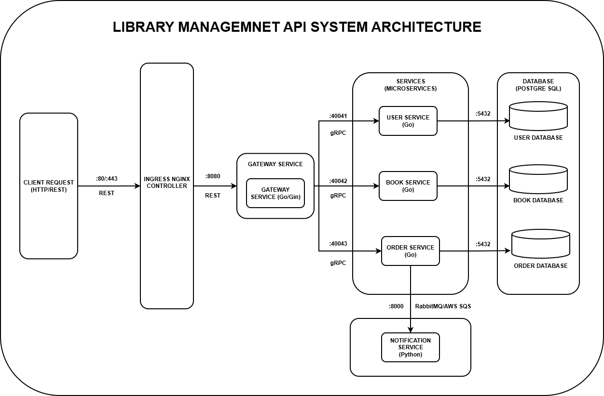

# Library Management System

[](https://go.dev/)
[](https://www.python.org/)
[](https://grpc.io/)
[](https://www.docker.com/)
[](https://kubernetes.io/)
[](https://www.postgresql.org/)
[](https://www.rabbitmq.com/)
[](https://redis.io/)
[](https://prometheus.io/)
[](./LICENSE)
[]()

---

## Description

The Library Management System is a cloud-native microservices application that simulates real-world library operations. Instead of visiting a physical library, users can perform operations online — browsing the catalog, placing book orders, and receiving email notifications — all through a REST API backed by gRPC internal services.

The system is designed to be deployed on **Kubernetes** (k3s, EKS, or any CNCF-conformant cluster) and optionally leverages **AWS managed services** (SES, RDS, ElastiCache).

---

## Architecture



---

## Services

| Service              | Language | Port    | Description                                     | README                                |
| -------------------- | -------- | ------- | ----------------------------------------------- | ------------------------------------- |
| Gateway Service      | Go       | `8080`  | REST API gateway — auth, routing, rate limiting | [→](./services/gateway-service/)      |
| User Service         | Go       | `40041` | User accounts, JWT, roles                       | [→](./services/user-service/)         |
| Book Service         | Go       | `40042` | Book catalog and inventory                      | [→](./services/book-service/)         |
| Order Service        | Go       | `40043` | Order lifecycle management                      | [→](./services/order-service/)        |
| Notification Service | Python   | —       | Event-driven email notifications                | [→](./services/notification-service/) |

---

## Tech Stack

| Layer            | Technology                          |
| ---------------- | ----------------------------------- |
| API Gateway      | Go, Gin, JWT, Redis (rate limiting) |
| Microservices    | Go (gRPC), Python                   |
| Messaging        | RabbitMQ                            |
| Databases        | PostgreSQL 16 (one per service)     |
| Caching          | Redis 7                             |
| Containerization | Docker, Docker Compose              |
| Orchestration    | Kubernetes + Kustomize              |
| Observability    | Prometheus, Grafana                 |
| Email            | AWS SES (boto3)                     |
| Protocols        | gRPC / Protocol Buffers, REST/HTTP  |

---

## Quick Start

### Prerequisites

- [Docker](https://docs.docker.com/get-docker/) and Docker Compose
- [Go 1.22+](https://go.dev/dl/) (for local development)
- [Python 3.x](https://www.python.org/downloads/) (for notification service)

### 1. Clone the repository

```bash
git clone https://github.com/DgHnG36/lib-management-system.git
cd lib-management-system
```

### 2. Start all services

```bash
make docker-run
# or
docker-compose up --build -d
```

### 3. Verify the system is healthy

```bash
curl http://localhost:8080/healthy
curl http://localhost:8080/ready
```

### 4. Register a user and start using the API

```bash
curl -s -X POST http://localhost:8080/api/v1/auth/register \
  -H "Content-Type: application/json" \
  -d '{"username":"alice","password":"Password123!","email":"alice@example.com"}'

curl -s -X POST http://localhost:8080/api/v1/auth/login \
  -H "Content-Type: application/json" \
  -d '{"username":"alice","password":"Password123!"}'
```

> See [docs/curl-tests.md](./docs/curl-tests.md) for the full API test reference.

### Teardown

```bash
make docker-down
```

---

## Project Structure

```
lib-management-system/
├── services/               # All microservices
│   ├── gateway-service/    # REST API gateway
│   ├── user-service/       # User management (gRPC)
│   ├── book-service/       # Book catalog (gRPC)
│   ├── order-service/      # Order management (gRPC)
│   └── notification-service/ # Email notifications (Python)
├── proto/                  # Protobuf definitions
├── shared/                 # Generated gRPC stubs (Go + Python)
├── k8s/                    # Kubernetes manifests (Kustomize)
├── monitoring/             # Prometheus + Grafana configuration
├── test/                   # Unit, integration, e2e, performance tests
├── docs/                   # Guides and references
├── docker-compose.yaml     # Local development stack
├── go.work                 # Go workspace file
└── Makefile                # Common developer commands
```

---

## Documentation

| Topic                 | Link                                                                                 |
| --------------------- | ------------------------------------------------------------------------------------ |
| Services overview     | [services/README.md](./services/README.md)                                           |
| Gateway Service       | [services/gateway-service/README.md](./services/gateway-service/README.md)           |
| User Service          | [services/user-service/README.md](./services/user-service/README.md)                 |
| Book Service          | [services/book-service/README.md](./services/book-service/README.md)                 |
| Order Service         | [services/order-service/README.md](./services/order-service/README.md)               |
| Notification Service  | [services/notification-service/README.md](./services/notification-service/README.md) |
| Protobuf definitions  | [proto/README.md](./proto/README.md)                                                 |
| Kubernetes deployment | [k8s/README.md](./k8s/README.md)                                                     |
| Monitoring            | [monitoring/README.md](./monitoring/README.md)                                       |
| Tests                 | [test/README.md](./test/README.md)                                                   |

---

## Available Make Targets

```bash
make help              # Show all available targets
make proto-all         # Generate all Protobuf stubs
make test-all          # Run all test suites
make test-integration  # Run integration tests
make test-e2e          # Run end-to-end tests
make test-performance  # Run performance tests (smoke/load/stress)
make docker-run        # Start all application containers
make docker-build      # Build all Docker images
make docker-down       # Stop and remove containers
```

---

## Contribution

1. Fork the repository and create a feature branch.
2. Follow the existing code style and package structure.
3. Make sure all tests pass before opening a pull request: `make test-all`.
4. Open a pull request with a clear description of the changes.

---

## Contributor

**[DgHnG36](https://github.com/DgHnG36)**

## License

This project is licensed under the [MIT License](./LICENSE).
